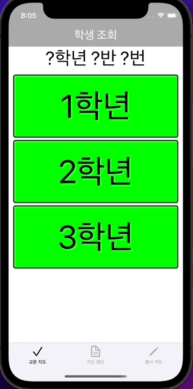
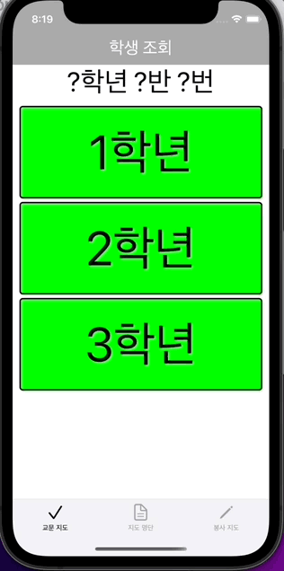
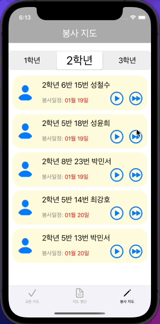
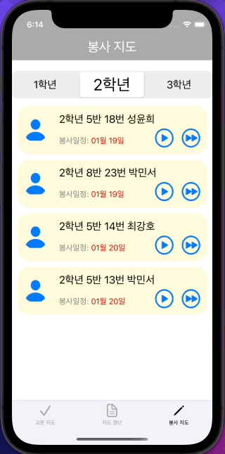

#  학생부 프로젝트 🧑‍🏫

하나의 앱을 클라이언트, 서버를 모두 스스로 구현하기 위해서 시작한 프로젝트입니다.

학생부 교사를 중심으로 학생들의 생활교육을 전교사가 공유하기 위한 앱입니다.

이 프로젝트에 대한 자세한 내용은 아래 블로그에서 보실 수 있습니다. 

👉 [개발 과정 자세히 보기](https://velog.io/@comdongsam/series/%ED%95%99%EC%83%9D%EB%B6%80-%EC%95%B1-%EA%B0%9C%EB%B0%9C-%EB%8F%84%EC%A0%84%EA%B8%B0)

서버 코드는 아래 깃허브에서 보실 수 있습니다.

👉 [서버 코드 보러가기](https://github.com/SteadySlower/HSB_server)

# 핵심 기능 설계 ⚙️
1. 반, 번호, 이름으로 학생 얼굴 조회
  
2. 학칙을 어긴 학생을 서버에 등록
  
3. 생활지도 명단 모아보기 (전체, 우리 학년, 우리 반)
  
4. 오늘 봉사한 학생 서버에 등록
  
5. 종례 시간에 담임교사에게 알람
  
6. 봉사를 미루거나 빼먹은 학생 서버에 등록

# 개발 블로그 북마크  📑

[0. 개발 목적 및 개요](https://velog.io/@comdongsam/0.-%ED%95%99%EC%83%9D%EB%B6%80-%EC%95%B1-%EA%B0%9C%EB%B0%9C-%EC%8B%9C%EC%9E%91%ED%95%A9%EB%8B%88%EB%8B%A4)
 
[1. 학생 얼굴 조회](https://velog.io/@comdongsam/1.-%ED%95%99%EC%83%9D-%EC%96%BC%EA%B5%B4-%EC%A2%80-%EB%B4%85%EC%8B%9C%EB%8B%A4-by-UICollectionView)

[2. 학칙 어긴 학생 등록](https://velog.io/@comdongsam/2.-%ED%95%99%EC%83%9D-%EB%B3%B5%EC%9E%A5%EB%B6%88%EB%9F%89)
 
[3. 생활지도명단 몰아보기](https://velog.io/@comdongsam/3.-%EB%88%84%EA%B0%80%EB%88%84%EA%B0%80-%EA%B1%B8%EB%A0%B8%EB%82%98-by-UITableView)
 
[4. 서버 개발 시작](https://velog.io/@comdongsam/4.-%EC%84%9C%EB%B2%84-%EA%B0%9C%EB%B0%9C-%EC%8B%9C%EC%9E%91)
 
[5. 서버에서 데이터 가져오기](https://velog.io/@comdongsam/5.-%EC%84%9C%EB%B2%84%EC%97%90%EC%84%9C-%EB%8D%B0%EC%9D%B4%ED%84%B0-%EA%B0%80%EC%A0%B8%EC%98%A4%EA%B8%B0)
 
[6. 서버에 데이터 보내기](https://velog.io/@comdongsam/6.-%EA%B5%90%EB%AC%B8%EC%97%90%EC%84%9C-%EC%84%9C%EB%B2%84%EB%A1%9C)
 
[7. 알람 기능 구현](https://velog.io/@comdongsam/7.-%EC%84%A0%EC%83%9D%EB%8B%98-%EC%A2%85%EB%A1%80%ED%95%A0-%EC%8B%9C%EA%B0%84%EC%9E%85%EB%8B%88%EB%8B%A4)
 
[8. 봉사지도 기능 구현](https://velog.io/@comdongsam/8.-%EC%8C%A4-%EC%A0%80-%EC%98%A4%EB%8A%98-%ED%95%99%EC%9B%90-%EA%B0%80%EC%95%BC%ED%95%98%EB%8A%94%EB%8D%B0%EC%9A%94). 

# 사용한 기술 🛠
## 클라이언트 (iOS)
- Swift, UIKit
- StoryBoard 없이 순수 코드로 UI 구현
- MVVM, Singleton, Delegate
- Swift Package Manager, Alamofire, Kingfisher
- Xcode, iOS simulator
## 서버 (nodejs)
- javascript, expressjs, npm, mysql2, pm2
- MySQL
- Visual Studio Code, Postman, MySQL WorkBench
## 공통
- git, github

# 앱 시연 갤러리 📷

## 학생 얼굴 조회

## 학칙 어긴 학생 서버에 등록

## 생활지도 명단 보기

## 담임교사 알람 기능

## 생활지도 완료 처리

## 생활지도 연기 처리

# Trouble Shooting 아카이브 🤔

