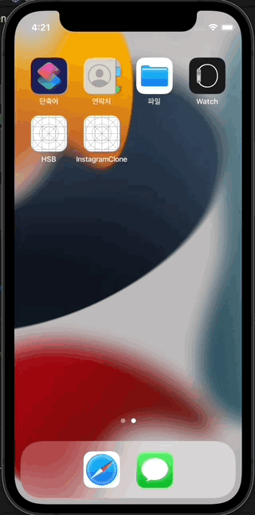

#  학생부 프로젝트 🧑‍🏫

하나의 앱을 클라이언트, 서버를 모두 스스로 구현하기 위해서 시작한 프로젝트입니다.

학생부 교사를 중심으로 학생들의 생활교육을 전교사가 공유하기 위한 앱입니다.  

교문에서 학생부 교사가 학생들의 생활지도 위반사항을 저장하고 담임교사가 위반 학생들의 명단을 확인할 수 있습니다.  

그리고 봉사담당 교사는 명단을 보고 봉사활동을 지도할 수 있습니다.  

이 프로젝트에 대한 자세한 내용은 아래 블로그에서 보실 수 있습니다. 

👉 [개발 과정 자세히 보기](https://velog.io/@comdongsam/series/%ED%95%99%EC%83%9D%EB%B6%80-%EC%95%B1-%EA%B0%9C%EB%B0%9C-%EB%8F%84%EC%A0%84%EA%B8%B0)

서버 코드는 아래 깃허브에서 보실 수 있습니다.

👉 [서버 코드 보러가기](https://github.com/SteadySlower/HSB_server)

# 핵심 기능 설계 ⚙️
1. 반, 번호, 이름으로 학생 얼굴 조회
  
2. 학칙을 어긴 학생을 서버에 등록
  
3. 생활지도 명단 모아보기 (전체, 우리 학년, 우리 반)
  
4. 오늘 봉사한 학생 서버에 등록
  
5. 종례 시간에 담임교사에게 알람
  
6. 봉사를 미루거나 빼먹은 학생 서버에 등록

# 개발 블로그 북마크  📑

[0. 개발 목적 및 개요](https://velog.io/@comdongsam/0.-%ED%95%99%EC%83%9D%EB%B6%80-%EC%95%B1-%EA%B0%9C%EB%B0%9C-%EC%8B%9C%EC%9E%91%ED%95%A9%EB%8B%88%EB%8B%A4)
 
[1. 학생 얼굴 조회](https://velog.io/@comdongsam/1.-%ED%95%99%EC%83%9D-%EC%96%BC%EA%B5%B4-%EC%A2%80-%EB%B4%85%EC%8B%9C%EB%8B%A4-by-UICollectionView)

[2. 학칙 어긴 학생 등록](https://velog.io/@comdongsam/2.-%ED%95%99%EC%83%9D-%EB%B3%B5%EC%9E%A5%EB%B6%88%EB%9F%89)
 
[3. 생활지도명단 몰아보기](https://velog.io/@comdongsam/3.-%EB%88%84%EA%B0%80%EB%88%84%EA%B0%80-%EA%B1%B8%EB%A0%B8%EB%82%98-by-UITableView)
 
[4. 서버 개발 시작](https://velog.io/@comdongsam/4.-%EC%84%9C%EB%B2%84-%EA%B0%9C%EB%B0%9C-%EC%8B%9C%EC%9E%91)
 
[5. 서버에서 데이터 가져오기](https://velog.io/@comdongsam/5.-%EC%84%9C%EB%B2%84%EC%97%90%EC%84%9C-%EB%8D%B0%EC%9D%B4%ED%84%B0-%EA%B0%80%EC%A0%B8%EC%98%A4%EA%B8%B0)
 
[6. 서버에 데이터 보내기](https://velog.io/@comdongsam/6.-%EA%B5%90%EB%AC%B8%EC%97%90%EC%84%9C-%EC%84%9C%EB%B2%84%EB%A1%9C)
 
[7. 알람 기능 구현](https://velog.io/@comdongsam/7.-%EC%84%A0%EC%83%9D%EB%8B%98-%EC%A2%85%EB%A1%80%ED%95%A0-%EC%8B%9C%EA%B0%84%EC%9E%85%EB%8B%88%EB%8B%A4)
 
[8. 봉사지도 기능 구현](https://velog.io/@comdongsam/8.-%EC%8C%A4-%EC%A0%80-%EC%98%A4%EB%8A%98-%ED%95%99%EC%9B%90-%EA%B0%80%EC%95%BC%ED%95%98%EB%8A%94%EB%8D%B0%EC%9A%94). 

# 사용한 기술 🛠
## 클라이언트 (iOS)
- Swift, UIKit
- StoryBoard 없이 순수 코드로 UI 구현
- MVVM, Singleton, Delegate
- Swift Package Manager, Alamofire, Kingfisher
- Xcode, iOS simulator
## 서버 (nodejs)
- javascript, expressjs, npm, mysql2, pm2
- MySQL
- Visual Studio Code, Postman, MySQL WorkBench
## 공통
- git, github

# 앱 시연 갤러리 📷

## 학생 얼굴 조회


## 학칙 어긴 학생 서버에 등록


## 생활지도 명단 보기


## 담임교사 알람 기능


## 생활지도 완료 처리


## 생활지도 연기 처리


# Trouble Shooting 아카이브 🤔
👉 더 구체적인 문제해결 과정은 [블로그](https://velog.io/@comdongsam/series/%ED%95%99%EC%83%9D%EB%B6%80-%EC%95%B1-%EA%B0%9C%EB%B0%9C-%EB%8F%84%EC%A0%84%EA%B8%B0)에서 보실 수 있습니다.

## 학년 별로 반의 버튼 갯수가 달라질 때 버튼 구현 (학생 얼굴 조회 기능)

### Trouble
학년의 3개로 고정되어 있지만 반과 학생의 수는 학년별로 반별로 서로 다르므로 화면에 다른 갯수의 버튼을 구현해야 했습니다.

### Shooting
UIStackView와 UICollectionView 중에서 고민하다가 UICollectionView를 선택하였습니다.
1. 복수의 row와 column으로 구성된 버튼들을 Stack으로 구현하기에는 복잡합니다.
2. UICollectionView의 delegate method (didSelect)를 통해서 버튼처럼 활용이 가능합니다.
3. UIButton로 구현하는 경우 selector 함수는 sender만 인자로 받기 때문에 선택된 학년, 반, 번호의 정보를 UIButton이 하나하나 가지고 있어야 합니다.

## 생활지도 사유가 기타일 때 구체적인 사유 저장

### Trouble
생활지도 주된 사유는 이미 정해져있으므로 미리 열거형으로 구현해서 사용자가 선택할 수 있도록 하였습니다. 
하지만 열거형으로 구현된 사유 이외의 기타 사유를 추가할 때 구체적인 내용을 열거형의 인스턴스 안에 저장해야 했습니다.

### Shooting
열거형의 String 연관값을 선언해서 구체적인 사유를 저장할 수 있도록 구현했습니다.
```swift
enum GuidanceReason {
    case wrongClothes
    case noShoes
    case trespassing
    case others(detail: String)
}
```

## 생활지도 사유 열거형과 사유 선택 actionSheet 연동하기

### Trouble
다른 생활지도 사유가 추가될 때 열거형에 새로운 사유를 추가하면 됩니다.  
하지만 해당 열거형을 선택하기 위해서 사용되는 모든 View에 수동으로 해당 열거형을 추가하는 번거로움이 예상되었습니다.  

### Shooting
열거형의 CaseIterable 프로토콜을 채용해서 모든 케이스를 list로 받아서 View에서 쓸 수 있도록 했습니다.  
연관값이 있는 열거형이기 때문에 allCases를 직접 구현했습니다.  
actionSheet (View)에서는 allCases에 forEach 적용해서 UIAlertAction을 구현했습니다.  
```swift
// 열거형
enum GuidanceReason: CaseIterable {
    case wrongClothes
    case noShoes
    case trespassing
    case others(detail: String)
    
    static var allCases: [GuidanceReason] = [.wrongClothes, .noShoes, .trespassing, .others(detail: "")]

        var description: String {
        switch self {
        case .wrongClothes: return "복장 불량"
        case .noShoes: return "실내화 없음"
        case .trespassing: return "무단횡단"
        case .others: return "기타"
        }
    }
}
```

```swift
// actionSheet 부분
lazy var actionSheet: UIAlertController = {
    let actionSheet = UIAlertController(title: nil, message: nil, preferredStyle: .actionSheet)
    GuidanceReason.allCases.forEach { reason in
        let action = UIAlertAction(title: reason.description, style: .default) { _ in
            self.actionSheetTapped(reason: reason)
        }
        actionSheet.addAction(action)
    }
    
    let cancel = UIAlertAction(title: "취소", style: .cancel)
    actionSheet.addAction(cancel)
    
    return actionSheet
}()
```

## UITableViewCell 내부에서 삭제 버튼 구현하기

### Trouble
UITableView 자체가 제공하는 삭제기능이 아니라 커스텀 Cell 내부에 삭제버튼을 넣고 해당 버튼이 클릭되면 데이터가 삭제되도록 구현하고자 했습니다.

### Shooting
delegate 패턴을 통해서 Cell에서 발생하는 이벤트를 VC에서 받아서 처리할 수 있도록 했습니다.
```swift
// Delegate Protocol 선언
protocol StudentListCellDelegate: AnyObject {
    func deleteButtonTapped(in cell: StudentListCell)
}
```
```swift
// Delegate Protocol 채택
extension StudentListViewController: StudentListCellDelegate {
    func deleteButtonTapped(in cell: StudentListCell) {
        guard let guidance = cell.guidance else { return }
        viewModel.deleteGuidance(guidance)
        reloadTableView()
    }
}
```

## HTTP Response 구조체 만들기

### Trouble
JSONEncoder를 사용하기 위해서는 구조체를 json과 동일한 구조로 만들어야 합니다.  
Response json은 아래와 같이 메타데이터 (isSuccess, code, message) + 실제데이터 (result) 구조로 되어있습니다.  
  
실제 데이터인 result까지 JSONEncoder를 통해서 한번에 디코딩할 수 있도록 구조체를 설계해야 합니다.

### Shooting
제네릭을 활용해서 Response 구조체를 구현했습니다.  
이렇게 구현하면 T에 Codable을 준수하는 다른 타입을 대입하면 JSONEncoder가 한번에 디코딩을 할 수 있습니다.  
```swift
struct Response<T: Codable>: Codable {
    let isSuccess: Bool
    let code: Int
    let message: String
    let result: T
}
```

## 서버에서 보내오는 JSON 구조가 앱에서 사용하는 구조체와 다를 때

### Trouble
서버에서 보내는 JSON 데이터와 앱에서 사용하는 구조체의 구조가 다를 경우가 있을 수 있습니다.  
이 경우에 서버가 보내주는 데이터를 앱에서 사용하는 구조체로 파싱할 필요가 있습니다.

### Shooting
서버에서 보내는 JSON의 구조에 맞게 Codable을 준수하는 RawData 구조체를 별도로 만들고  
앱에서 사용하는 구조체에는 해당 RawData를 인자로 받는 initializer를 구현합니다.  
```swift
// RawData 구조체
struct GuidanceRawData: Codable {
    let studentID: Int
    let grade: Int
    let classNumber: Int
    let number: Int
    let name: String
    let profileURLImage: String?
    let guidanceID: Int
    let reason: String
    let detail: String?
}

// 앱에서 사용하는 구조체
struct Guidance {
    let id: Int
    let student: Student
    let reason: GuidanceReason
    
    init(rawData: GuidanceRawData) {
        self.id = rawData.guidanceID
        self.student = Student(from: rawData)
        self.reason = GuidanceReason(from: rawData)
    }
}
```

## 특정 조건으로 필터링된 데이터를 반환하는 뷰모델

### Trouble
학생 리스트는 전체, 학년, 반을 기준으로 필터된 학생 리스트를 보여줍니다.  
해당 리스트의 데이터를 그때그때 서버에서 불러오면 불필요한 네트워크 통신을 너무 많이하게 됩니다.

### Shooting
ViewModel이 처음에 init될 때 서버에서 데이터를 가져와서 클래스 내부에서 사용하는 _guidance 안에 캐싱해둡니다.  
그리고 filter 조건에 맞추어서 ViewModel 외부에서 접근이 가능한 guidance에 필터가 바뀔 때 마다 조건에 맞추어 새로운 배열을 세팅합니다.  
이렇게 하면 filter를 할 때마다 API 통신을 하지 않고도 필터링된 데이터를 제공할 수 있습니다.
```swift
class StudentListViewModel {
    
    private var _guidances: [Guidance] {
        didSet {
            filterGuidances()
        }
    }
        
    lazy var guidances: [Guidance] = _guidances
    
    var filter: GuidanceListFilter = .all {
        didSet {
            filterGuidances()
        }
    }

    // 필터링하는 메소드
    private func filterGuidances() {
        switch filter {
        case .all:
            self.guidances = _guidances
        case .myGrade:
            self.guidances = _guidances.filter { guidance in
                guidance.student.grade == 1
            }
        case .myClass:
            self.guidances = _guidances.filter { guidance in
                guidance.student.grade == 1 && guidance.student.classNumber == 1
            }
        }
    }
}
```

##

### Trouble

### Shooting